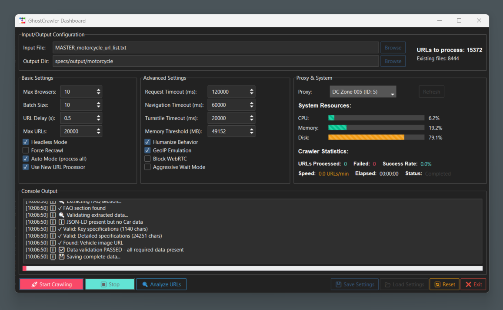

# GhostCrawler

A high-performance, stealth web crawler and scraper with advanced anti-detection capabilities.

## Features
- **Stealth Crawling**: Uses Camoufox browser with humanization features to avoid detection
- **Cloudflare Turnstile Support**: Automatically detects and handles Turnstile challenges
- **Dynamic Browser Management**: Creates and destroys browsers on-demand for optimal resource usage
- **Smart URL Deduplication**: Automatically skips already crawled URLs to avoid redundant processing
- **Multi-browser Concurrency**: Run multiple browser instances simultaneously for faster crawling
- **Proxy Support**: Full proxy integration with authentication support
- **Resource Blocking**: Blocks unnecessary resources (CSS, images, fonts) for faster page loads
- **Memory Management**: Automatic garbage collection and memory threshold monitoring
- **Detailed Logging**: Comprehensive logging system for debugging and monitoring
- **GUI Dashboard**: Modern ttkbootstrap-based interface for easy configuration and monitoring
- **Progress Tracking**: Real-time statistics on crawl progress, success rates, and speed




### Setup
1. Clone the repository
2. Install dependencies

# Install camoufox with GeoIP

```bash
pip install 'camoufox[geoip]'
```

# Download Camoufox binary (Add to your PATH)

```bash
camoufox fetch
```

# Add Camoufox to your PATH

```bash
export PATH=$PATH:/path/to/camoufox
```

# Install additional GUI dependencies (if using GUI)

```bash
pip install ttkbootstrap
```


#### Command Line Arguments
- `input_file`: Path to file containing URLs (one per line)
- `-o, --output`: Output directory (default: specs/output)
- `-b, --batch-size`: Number of URLs to process in parallel (default: 20)
- `-d, --delay`: Delay between URLs in seconds (default: 1.0)
- `--browsers`: Number of concurrent browsers (default: 2)
- `--headless`: Run browsers in headless mode
- `--no-stealth`: Disable stealth mode features
- `--force-recrawl`: Force recrawl of already processed URLs
- `--use-new-filter`: Use enhanced URL deduplication processor
- `--proxy`: Proxy ID to use from .config/proxy.json
- `--list-proxies`: List available proxies and exit
- `--max-urls`: Maximum number of URLs to process
- `--auto`: Process all URLs without limits

### Graphical User Interface

Launch the GUI dashboard:
```bash
python ghostcrawler_auto_gui.py
```

The GUI provides:
- Visual configuration of all crawler settings
- Real-time monitoring of system resources (CPU, Memory, Disk)
- Live crawling statistics and progress tracking
- Console output with color-coded messages
- Settings persistence (save/load configurations)

### Interactive Mode

Run without arguments for interactive configuration:

```bash
python ghostcrawler.py
```

This will guide you through:
1. Input file selection (with file browser)
2. Output directory selection
3. Crawler configuration options
4. Proxy selection

### Environment Variables

The `.env` file is used for default proxy settings:
```env
BRD_SERVER=http://proxy.example.com:8080
BRD_USERNAME=your_username
BRD_PASSWORD=your_password
```

## Output Structure

Crawled data is organized by manufacturer:
```
output/
├── toyota/
│   └── TOYOTA_RAW_HTML/
│       ├── 123-camry-2024.html
│       └── 124-corolla-2024.html
├── honda/
│   └── HONDA_RAW_HTML/
│       └── 456-civic-2024.html
└── crawl_progress.json
```

Each HTML file contains:
- JSON-LD structured data
- Key specifications
- Detailed specifications
- Vehicle images URLs

## Advanced Features

### URL Processing

The URL processor (`url_processor.py`) provides:
- Automatic detection of already crawled URLs
- Progress tracking and reporting
- Batch URL validation and deduplication
- Crawl progress persistence

### Resource Blocking

Automatically blocks:
- Stylesheets (CSS)
- Images (JPG, PNG, WebP, etc.)
- Fonts (WOFF, WOFF2)
- Media files
- Other non-essential resources

Exceptions are made for:
- Cloudflare challenge resources
- Turnstile widgets
- Specified allow patterns

### Memory Management

- Automatic garbage collection when memory usage exceeds thresholds
- Dynamic browser lifecycle management
- Process memory monitoring
- Configurable memory thresholds

## Monitoring and Debugging

### Log Files
- `ghostcrawler.log`: Main application log
- `logs/failure_reasons.json`: Detailed failure tracking
- `crawl_progress.json`: Progress checkpoint file

### Statistics Tracking
- URLs processed successfully
- Failed URLs with reasons
- Success rate percentage
- Processing speed (URLs/minute)
- Memory and CPU usage

## Best Practices

1. **Start Small**: Test with a small batch of URLs first
2. **Monitor Resources**: Keep an eye on memory usage with large crawls
3. **Use Proxies**: Rotate proxies for large-scale crawling
4. **Adjust Delays**: Add delays between requests to avoid rate limiting
5. **Enable Logging**: Use logs for debugging failed URLs

## Troubleshooting

### Common Issues

1. **Turnstile Challenges Failing**
   - Increase `turnstile_timeout`
   - Ensure proxy is residential/clean
   - Try with `headless=False` to debug

2. **High Memory Usage**
   - Reduce `max_browsers` count
   - Lower `batch_size`
   - Decrease `memory_threshold_mb`

3. **Slow Performance**
   - Increase `max_browsers` if resources allow
   - Disable unnecessary resource loading
   - Use faster proxies

4. **Missing Data**
   - Enable `aggressive_wait_mode` for slow sites
   - Increase element timeouts
   - Check selectors match current site structure

